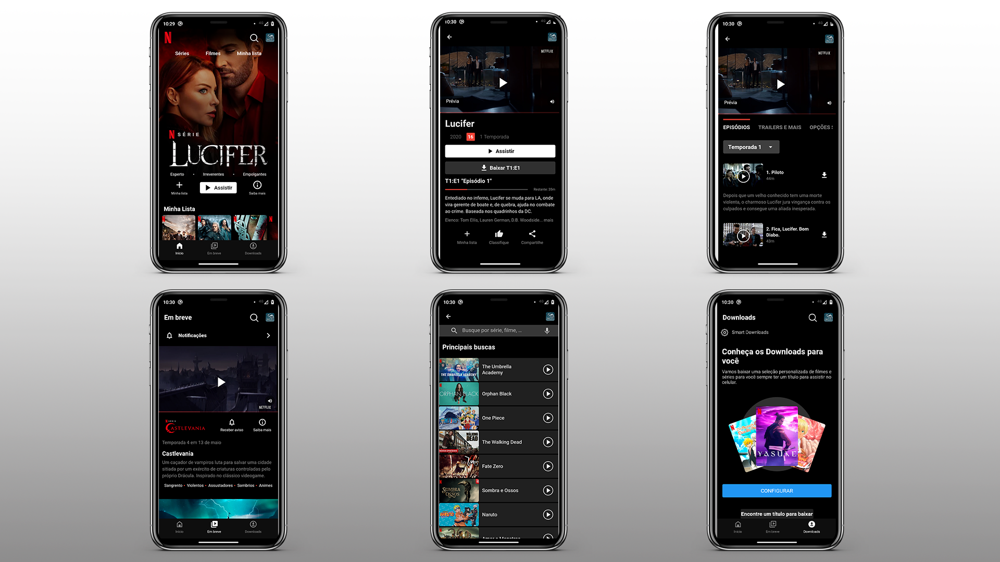
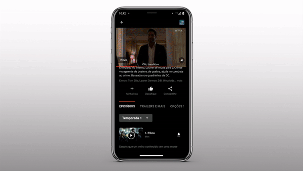

# Netflix UI Clone App Flutter

## Description

Aplicativo clone da UI do aplicativo da Netflix desenvolvido com o framework [Flutter](https://flutter.dev/?gclid=Cj0KCQjwh_eFBhDZARIsALHjIKdqATCld5p0iiYi6y3rP_zgZtbNDmimnJi9tqpnBiDhpSERx9ECp1IaApyYEALw_wcB&gclsrc=aw.ds).

Este app foi desenvolvido a nível didático, com intuito de ensinar a criar UIs bonitas e funcionais com Flutter.

Me acompanhe no [Youtube](https://www.youtube.com/channel/UCVValMWX9CjPx8o6Vi-vp5w) onde ensino desenvolvimento de aplicações.

## Getting Started

This project is a starting point for a Flutter application.

A few resources to get you started if this is your first Flutter project:

- [Lab: Write your first Flutter app](https://flutter.dev/docs/get-started/codelab)
- [Cookbook: Useful Flutter samples](https://flutter.dev/docs/cookbook)

For help getting started with Flutter, view our
[online documentation](https://flutter.dev/docs), which offers tutorials,
samples, guidance on mobile development, and a full API reference.
